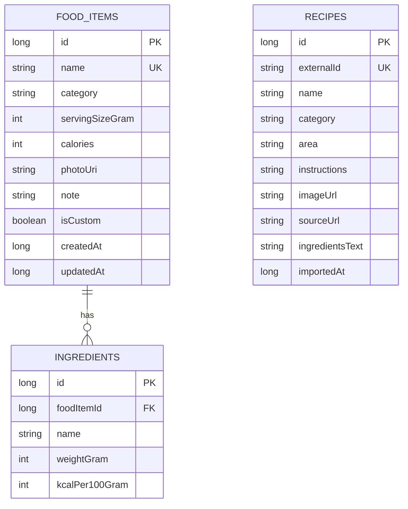

# 데이터 모델

## ERD

## 테이블 설명

### food_items

음식 사전의 핵심 엔티티다. 음식 이름은 중복 저장을 막기 위해 unique index를 사용한다. `photoUri`는 실제 이미지 파일이 아니라 앱 내부 저장소에 저장된 사진의 URI 문자열이다.

### ingredients

직접 만든 음식의 재료 정보를 저장한다. 하나의 음식은 여러 재료를 가질 수 있고, 음식 삭제 시 재료도 함께 삭제된다.

### recipes

TheMealDB API에서 가져온 레시피 원문 정보를 저장한다. `externalId`로 중복 저장을 막고, `imageUrl`은 외부 음식 사진 표시용으로 사용한다. 가져온 레시피는 동시에 `food_items`에도 저장되어 오프라인 음식 사전에서 다시 볼 수 있다.

## 칼로리 계산

- 재료 kcal = `중량(g) * 100g당 kcal / 100`
- 재료 합산 kcal은 등록/수정 화면에서 참고값으로 표시한다.
- 최종 kcal은 사용자가 직접 보정할 수 있으며 `food_items.calories`에 저장한다.

## 외부 API 저장 정책

- API 응답의 음식명, 카테고리, 국가, 설명, 재료 목록, 이미지 URL을 저장한다.
- 레시피 import 시 기본 kcal은 사용자가 나중에 수정할 수 있도록 100kcal로 저장한다.
- API 실패나 오프라인 상황에서도 기존 Room 데이터는 계속 조회 가능하다.
