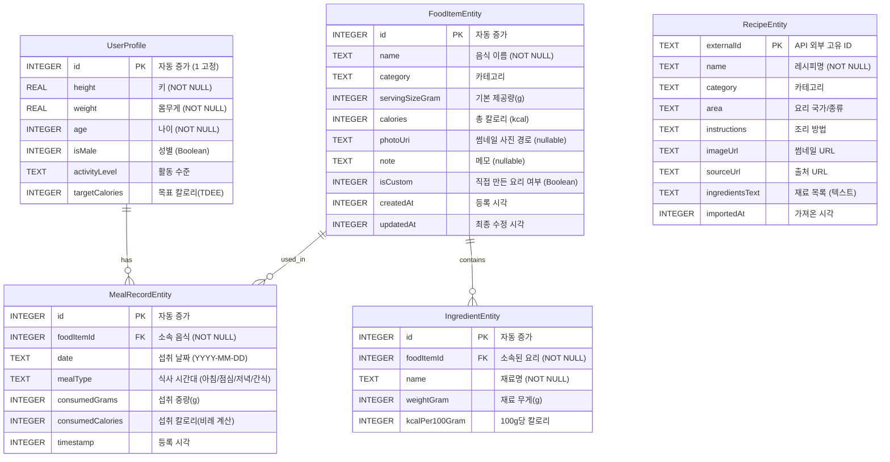

# 데이터 모델 및 ERD — 스마트 칼로리 트래커

## 1. ER 다이어그램 (Mermaid)

## 2. 테이블 상세

### 2.1 FoodItemEntity (음식 사전)

음식 마스터 테이블. 일반 음식, 가공식품, 직접 만든 커스텀 요리 모두 이 테이블에 등록된다.

| 컬럼 | 타입 | 제약조건 | 설명 |
|------|------|---------|------|
| id | INTEGER | PK, AUTOINCREMENT | 고유 식별자 |
| name | TEXT | NOT NULL | 음식 이름 |
| category | TEXT | NOT NULL | 카테고리 분류 (기본값: 기타) |
| servingSizeGram | INTEGER | NOT NULL | 기본 1회 제공량(g) |
| calories | INTEGER | NOT NULL | servingSizeGram 기준 칼로리 |
| photoUri | TEXT | nullable | 로컬 갤러리 이미지 URI 경로 |
| note | TEXT | NOT NULL | 요리 설명 메모 |
| isCustom | INTEGER | NOT NULL | 사용자가 재료를 조합해 만든 요리인지 여부 (Boolean) |
| createdAt | INTEGER | NOT NULL | 생성 시각 (System.currentTimeMillis) |
| updatedAt | INTEGER | NOT NULL | 수정 시각 (System.currentTimeMillis) |

### 2.2 IngredientEntity (재료)

직접 만든 요리(`isCustom = true`)에 포함된 하위 재료들을 관리하는 테이블.

| 컬럼 | 타입 | 제약조건 | 설명 |
|------|------|---------|------|
| id | INTEGER | PK, AUTOINCREMENT | 고유 식별자 |
| foodItemId | INTEGER | FK → FoodItemEntity(id), CASCADE | 소속 음식(요리) ID |
| name | TEXT | NOT NULL | 재료명 (예: 닭가슴살, 양파) |
| weightGram | INTEGER | NOT NULL | 해당 요리에 들어간 재료의 양(g) |
| kcalPer100Gram | INTEGER | NOT NULL | 해당 재료의 100g당 칼로리 |

### 2.3 MealRecordEntity (식사 기록 / 다이어리)

사용자가 특정 날짜에 섭취한 음식의 이력을 기록하는 테이블.

| 컬럼 | 타입 | 제약조건 | 설명 |
|------|------|---------|------|
| id | INTEGER | PK, AUTOINCREMENT | 고유 식별자 |
| foodItemId | INTEGER | FK → FoodItemEntity(id), CASCADE | 섭취한 음식 ID |
| date | TEXT | NOT NULL | 섭취 날짜 (형식: "yyyy-MM-dd") |
| mealType | TEXT | NOT NULL | 식사 종류 ("아침", "점심", "저녁", "간식") |
| consumedGrams | INTEGER | NOT NULL | 실제 섭취한 중량(g) |
| consumedCalories | INTEGER | NOT NULL | 제공량 대비 비율 계산된 실제 섭취 칼로리 |
| timestamp | INTEGER | NOT NULL | 기록 등록 시각 |

### 2.4 RecipeEntity (요리백과 레시피 캐시)

식약처 공공데이터(COOKRCP01) 등 API에서 불러온 외부 레시피를 오프라인용으로 저장(캐싱)하는 테이블.

| 컬럼 | 타입 | 제약조건 | 설명 |
|------|------|---------|------|
| externalId | TEXT | PK | API에서 제공하는 레시피 고유 식별자 |
| name | TEXT | NOT NULL | 레시피 이름 |
| category | TEXT | NOT NULL | 분류 (반찬, 국/찌개 등) |
| area | TEXT | NOT NULL | 종류 (한식, 중식 등) |
| instructions | TEXT | NOT NULL | 텍스트 형태의 조리법 설명 |
| imageUrl | TEXT | NOT NULL | 썸네일 이미지 외부 URL |
| sourceUrl | TEXT | NOT NULL | 상세 정보 출처 URL |
| ingredientsText | TEXT | NOT NULL | \n으로 구분된 재료 목록 전체 텍스트 |
| importedAt | INTEGER | NOT NULL | 캐시 저장 시각 |

### 2.5 UserProfile (사용자 정보 임시 참조 구조)
현재 SharedPreferences로 단일 객체 관리 중이나, 개념적 모델링 관점에서는 `id=1`인 단일 레코드로 취급 가능.
(키, 몸무게, 나이, 성별, BMR, TDEE 등)

## 3. 설계 결정 사항

### 음식과 재료의 1:N 분리 (`FoodItemEntity` - `IngredientEntity`)
사용자가 직접 만든 요리의 경우 여러 재료가 조합되어 하나의 완성된 음식(칼로리)이 된다.
- FoodItemEntity: 완성된 요리의 전체 칼로리와 사진, 이름을 갖는다.
- IngredientEntity: 구성된 하위 재료들만 관리한다.
수정 뷰에서 하위 재료를 자유롭게 추가/삭제할 수 있도록 정규화하였다. 
- 삭제 시 `CASCADE` 옵션을 주어 부모 요리가 지워지면 재료들도 함께 제거된다.

### 음식 마스터와 식사 기록 이력의 분리 (`FoodItemEntity` - `MealRecordEntity`)
'닭가슴살'이라는 음식 마스터는 한 개지만, 매일 아침/저녁으로 섭취할 수 있다.
- MealRecordEntity는 단순히 FoodItemEntity의 `id`를 참조(FK)하고, 언제(Date) 얼마만큼(consumedGrams) 먹었는지의 "이력(Log)"만 담당한다.
- 사용기한은 없으나, 섭취 날짜인 `date`를 "yyyy-MM-dd" 형식의 String으로 저장하여 SQLite에서 `WHERE date = ?` 검색이 즉시 가능하도록 설계하였다.

### 외부 레시피 캐싱 (`RecipeEntity`)
오프라인 퍼스트(Offline-First) 철학을 위해 검색한 레시피 중 마음에 드는 것을 내 DB로 복사(Import)해 와야 한다.
- RecipeEntity는 외부 데이터 형식을 그대로 담아두는 보관용(Cache) 테이블이다.
- 이 테이블에 레시피를 저장함과 동시에, 식단 기록에 즉시 써먹을 수 있도록 `FoodItemEntity`에도 변환하여 Insert하는 전략(Double-write)을 채택했다.
