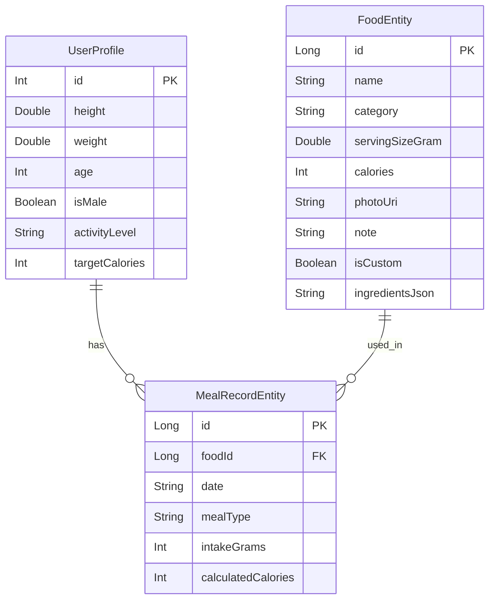

# 데이터 모델 및 ERD (Data & ERD)

## 1. Entity Relationship Diagram (ERD)

## 2. 테이블 설명
1. **UserProfile (프로필 테이블):**
   * 사용자의 신체 정보 및 목표 칼로리(TDEE)를 단일 레코드로 저장. (id=1로 고정하여 업데이트)
2. **FoodEntity (음식 사전 테이블):**
   * 앱 내에 등록된 모든 음식(단일 음식 및 직접 만든 요리)의 마스터 데이터.
   * `ingredientsJson`: 직접 만든 음식일 경우, 구성 재료 리스트를 JSON 형태로 직렬화하여 저장.
3. **MealRecordEntity (식사 기록 테이블):**
   * 특정 날짜(`date`), 특정 시간대(`mealType`)에 사용자가 섭취한 음식 기록.
   * `foodId`를 통해 FoodEntity와 논리적 외래키(FK) 관계를 맺음.
